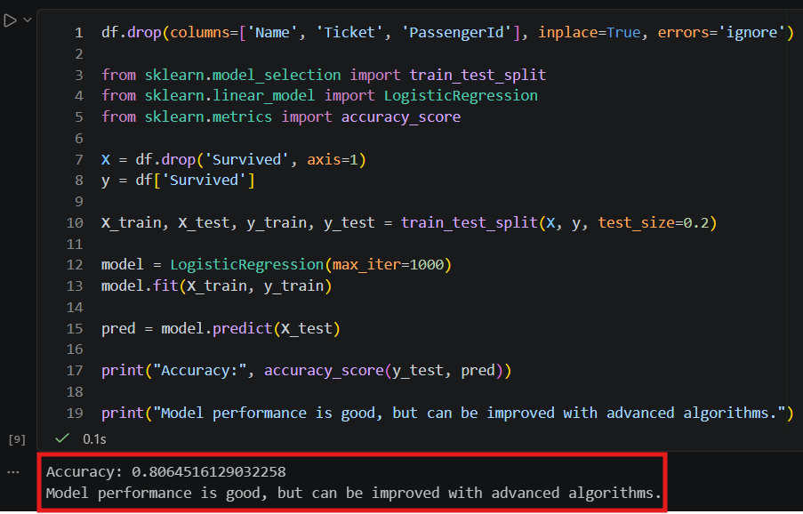
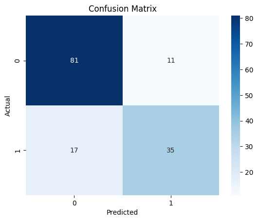

# 🚢 Titanic Data Preprocessing & Machine Learning Project

## 📌 Project Overview

This project focuses on cleaning and preprocessing the Titanic dataset and building a machine learning model to predict passenger survival.

It demonstrates a complete end-to-end workflow from raw data to model evaluation.

---

## ⚙️ Steps Performed

### 🧹 Data Cleaning

* Handled missing values using median (Age) and mode (Embarked)
* Dropped irrelevant or highly missing columns (Cabin)

### 🔄 Feature Engineering

* Converted categorical variables into numerical format
* Applied Label Encoding (Sex)
* Applied One-Hot Encoding (Embarked)

### 📏 Feature Scaling

* Standardized numerical features (Age, Fare) using StandardScaler

### 📊 Outlier Detection

* Visualized outliers using boxplots
* Removed outliers using IQR (Interquartile Range) method

### 🤖 Model Building

* Split dataset into training and testing sets
* Trained Logistic Regression model

### 📈 Model Evaluation

* Evaluated model using Accuracy Score
* Visualized performance using Confusion Matrix

---

## 📊 Results

* Cleaned dataset generated successfully
* Machine learning model trained and evaluated
* Achieved reliable prediction performance on test data

---

## 🛠️ Tech Stack

* Python
* Pandas, NumPy
* Matplotlib, Seaborn
* Scikit-learn

---

## 📁 Project Structure

```
Titanic-Data-Preprocessing/
│
├── Titanic-Dataset.csv                      # Raw dataset
├── cleaned_titanic.csv                      # Processed dataset
├── Data Cleaning & Preprocessing.ipynb      # Full implementation
├── README.md                                # Project documentation
```

---

## 🚀 How to Run

1. Clone the repository
2. Open the notebook (`preprocessing.ipynb`)
3. Run all cells
4. View results and outputs

---

## 🎯 Key Learnings

* Data preprocessing techniques in machine learning
* Handling missing and categorical data
* Feature scaling and outlier removal
* Model training and evaluation workflow

---

## 👨‍💻 Author

**Prasanna G**
---

## 📸 Output Preview

### 🔹 Model Accuracy


### 🔹 Confusion Matrix

